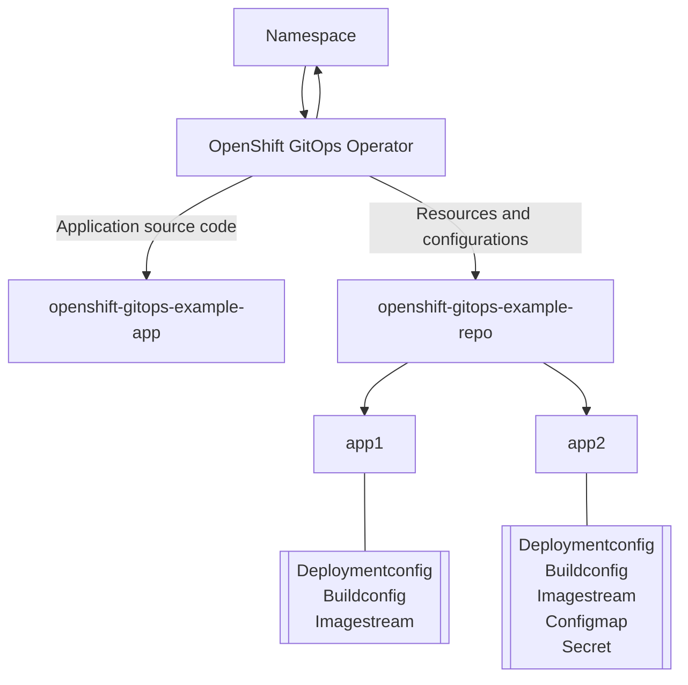

# openshift-gitops-example-app
Example repository for GitOps and CI/CD with ArgoCD &amp; OpenShift GitOps Operator

## About GitOps

GitOps is a declarative way to implement continuous deployment for cloud native applications. You can use GitOps to create repeatable processes for managing applications in Kubernetes environments. GitOps handles and automates complex deployments at a fast pace, saving time during deployment and release cycles.

The GitOps either deploys a new application or updates an existing one, so you only need to update the repository; GitOps automates everything else.

GitOps is a set of practices that use Git pull requests to manage application configurations. In GitOps, the Git repository is the only source of truth for system and application configuration. This Git repository contains a declarative description of the infrastructure you need in your specified environment and contains an automated process to make your environment match the described state. Also, it contains the entire state of the system so that the trail of changes to the system state are visible and auditable. By using GitOps, you resolve the issues of infrastructure and application configuration sprawl.

By following the principles of the code, you can store the configuration of applications in Git repositories, and then follow the Git workflow to apply these repositories to your chosen clusters. You can apply the core principles of developing and maintaining software in a Git repository to the creation and management of your application configuration files.

## Reference

- https://docs.openshift.com/container-platform/4.10/cicd/gitops/understanding-openshift-gitops.html
